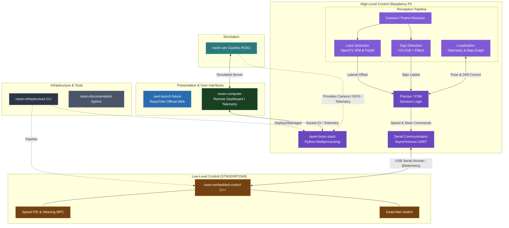

# RAVEN - Infrastructure ("The Launchpad")

 

The **Infrastructure** repository is the glue that holds the Raven system together. It provides the tools to deploy, configure, and launch the vehicle software stack with a single command.

## 🌍 Global System Architecture



## 🚀 The `raven` CLI
We provide a unified command-line tool to manage the car. One command launches everything.

### Installation
```bash
# From the root of this repo
./install.sh
```

### Usage
```bash
raven start [mode]              # Start the full Skynet stack (autonomous/manual/debug)
raven start --laptop-ip X.X.X.X # Start with known Mac IP (skips prompt)
raven start --no-stream          # Start without video streaming
raven start --no-arduino         # Bench-test without Arduino
raven stream                     # Start ONLY the Mac video viewer (run before Pi)
raven calibrate --x 50 --y 30 --heading 90  # Set car start pose on map
raven stop                       # Stop all services
raven status                     # Live system health (processes, Arduino, CPU temp, pose)
raven logs                       # Tail all live logs in real time
raven flash [--arch arduino]     # Compile and flash firmware
raven pull                       # Pull latest changes for all repos
raven push [-m msg]              # Commit and push all repos
raven docs [build|open|check]    # Manage Sphinx documentation
raven test [repo]                # Run test suite
```

## 🏁 Race Day Scenario (Step-by-Step)

Here is the exact sequence of commands required to run the car on the track for a competition or test run:

### 1. Map Upload (One-time per track)
Since we are using **Map-based Localization**, the very first step is giving the car the track topology.
1. Place your track SVG/PNG map file into `raven-brain-stack/data/maps/current_track.png`.
2. That's it! (When built, the `threadLocalization.py` will read this automatically on boot to build the waypoint graph).

### 2. Set the Starting Pose
The car needs to know exactly where on the map it is starting for the odometry to work correctly.
```bash
# Example: Car is placed at X=120cm, Y=80cm on the map, facing 90 degrees (North)
# Run this on your Mac or SSH'd into the Pi:
raven calibrate --x 120 --y 80 --heading 90
```
*Note: This saves the pose to `/tmp/raven_start_pose.json` for Skynet to read.*

### 3. Connect Video Telemetry (Mac)
Open a terminal on your Mac to receive the live HUD feed from the car camera:
```bash
# Run this ON YOUR MAC (requires OpenCV):
raven stream
```
*The viewer will say "Waiting for Pi to connect...". Leave this terminal open.*

### 4. Launch Autonomous Stack (Raspberry Pi)
SSH into the Raspberry Pi and fire up the unified system:
```bash
# Run this ON THE PI:
raven start --laptop-ip <YOUR_MAC_IP_ADDRESS>
```
*Behind the scenes, this launches 5 threads: Perception, OpenCV Lane Keeping, IMU Odometry, Planner, and Arduino Serial.*

### 5. Monitor Health (Optional)
Open a second SSH terminal to the Pi to check if things are running smoothly:
```bash
raven status  # Check CPU temp, Running PIDs, and Start Pose
raven logs    # Watch the decision-making logs in real time
```

### 6. Stop the Run
When the lap is finished, or you need to abort:
```bash
raven stop
```

## 🧪 Testing & Verification

We support both bulk testing and targeted repository testing to ensure 98%+ code coverage.

### Bulk Testing (All Repos)
Run the full CI/CD test suite across the entire stack:
```bash
raven test
```

### Targeted Testing
Test a specific repository in isolation:
```bash
raven test raven-brain-stack
raven test raven-embedded-control
```

## 📚 Documentation Management

Keep the knowledge base healthy with our smart doc tools:

- `raven docs check`: Verify that all new feature code is documented.
- `raven docs build`: Compile the Sphinx documentation locally.
- `raven docs open`: Serve the documentation on a local web server.

## 📂 Structure
- **`cli/`**: Python-based CLI tool source code.
- **`ansible/`**: Playbooks to provision the Raspberry Pi from scratch (install ROS, OpenCV, dependencies).
- **`systemd/`**: Service files to auto-start the Raven stack on boot.
- **`docker/`**: (Optional) Container definitions for isolated environments.

## ⚡ Quick Start (Manual)
To run the setup script on a fresh Raspberry Pi:
```bash
sudo ./scripts/setup_pi.sh
```
